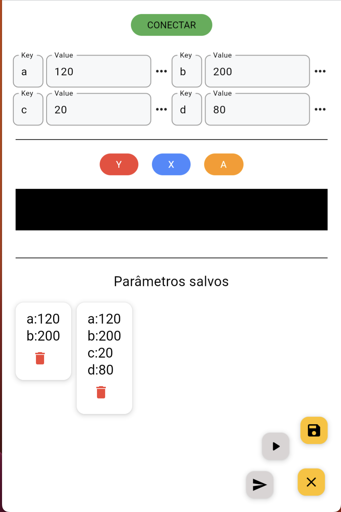

# Follow Line App - Controle Bluetooth para Arduino


O Follow Line App é um aplicativo desenvolvido em Flutter que permite o controle de um robô através de comandos enviados via Bluetooth para um Arduino. Ele foi desenvolvido pela equipe de robótica Wickedbotz como parte de um projeto de seguidor de linha.


## Pré-requisitos

- Flutter SDK v3.10.0 ou superior.
- Dispositivo físico Android
- Arduino com modulo Bluetooth HC-05

## Instalação e Configuração

1. Certifique-se de ter o Flutter SDK instalado em sua máquina. Para obter instruções de instalação, consulte a documentação oficial do Flutter: [Flutter - Get Started](https://flutter.dev/docs/get-started).

2. Clone este repositório para o seu ambiente local:

```bash
git clone https://github.com/wickedbotz/follow-line-app.git
```


